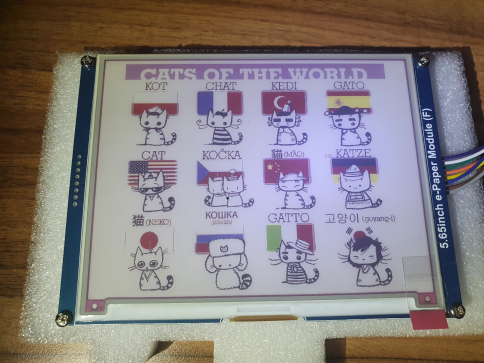
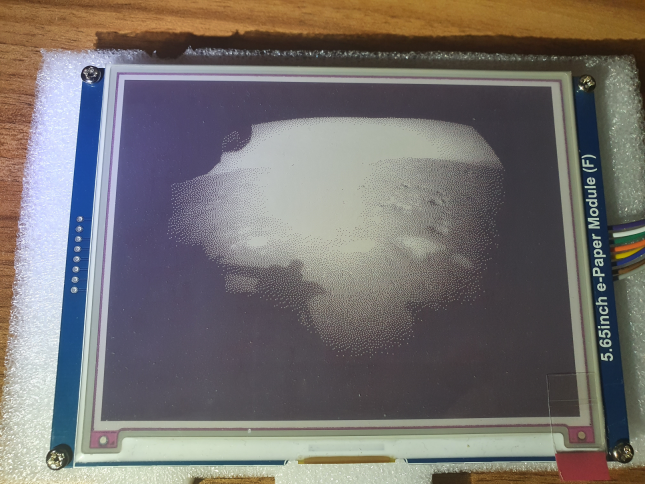

# ReadMePaper
Just some ESP32 - ePaper 7 Color project 🎉

### Parts used:
- ePaper screen: https://www.waveshare.com/5.65inch-e-paper-module-f.htm
- ESP32 Feather: https://www.adafruit.com/product/3405

### Examples of 24bit BMP ~700kb across WiFi to ESP32 SPIFFS to ePaper

